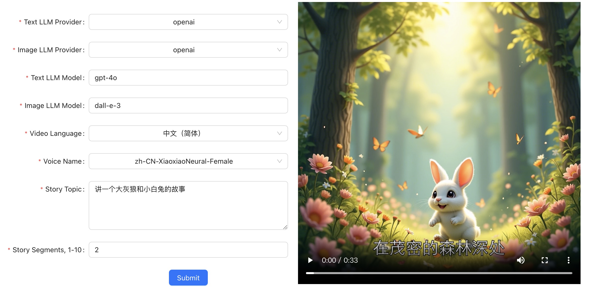

English | [简体中文](./README-CN.md)

## Project Description

This project allows users to input a story theme and generates a story video using a large language model. The video includes AI-generated images, story content, audio, and subtitles.

The backend technology stack consists of Python + FastAPI framework, while the frontend is built with React + Ant Design + Vite.

## Video Demonstration

<table>
<thead>
<tr>
<th align="center"><g-emoji class="g-emoji" alias="arrow_forward">▶️</g-emoji> The Story of the Big Gray Wolf and the Little White Rabbit</th>
<th align="center"><g-emoji class="g-emoji" alias="arrow_forward">▶️</g-emoji> The Story of the Rabbit and the Little Fox</th>
</tr>
</thead>
<tbody>
<tr>
<td align="center"><video src="https://github.com/user-attachments/assets/8868e1b5-a931-4d25-9762-859a4c32d4f4"></video></td>
<td align="center"><video src="https://github.com/user-attachments/assets/4585c59c-966a-40c7-97d0-505fbe00cf4f"></video></td>
</tr>
</tbody>
</table>

## Interface Screenshot



## Usage Instructions

1. Download the project

```
git clone https://github.com/alecm20/story-flicks.git
```

2. Set model information

```
# First, switch to the project root directory
cp .env.example .env


text_provider="openai"    # Text generation model provider, currently only supports openai and aliyun. Aliyun documentation: https://www.aliyun.com/product/bailian

image_provider="aliyun"   # Image generation model provider, currently only supports openai and aliyun

openai_base_url="https://api.openai.com/v1" # Base URL for OpenAI

aliyun_base_url="https://dashscope.aliyuncs.com/compatible-mode/v1" # Base URL for Aliyun

openai_api_key= # OpenAI API key (you can provide either one)
aliyun_api_key= # Aliyun API key (you can provide either one)

text_llm_model=gpt-4o # If text_provider is set to openai, only OpenAI models can be used, such as gpt-4o. If aliyun is selected, Aliyun models like qwen-plus or qwen-max can be used.

image_llm_model=flux-dev # If image_provider is set to openai, only OpenAI models can be used, such as dall-e-3. If aliyun is selected, Aliyun models like flux-dev are recommended, which are currently available for free trial. More details: https://help.aliyun.com/zh/model-studio/getting-started/models#a1a9f05a675m4.
```

3. Start the backend project

```
# First, switch to the project root directory
cd backend
conda create -n story-flicks python=3.10 # Using conda, other virtual environments can also be used
conda activate story-flicks
pip install -r requirements.txt
uvicorn main:app --reload
```

If the project starts successfully, the following output will appear:

```
INFO:     Uvicorn running on http://127.0.0.1:8000 (Press CTRL+C to quit)
INFO:     Started reloader process [78259] using StatReload
INFO:     Started server process [78261]
INFO:     Waiting for application startup.
INFO:     Application startup complete.
```

4. Start the frontend project

```
# First, switch to the project root directory
cd frontend
npm install
npm run dev

# After successful startup, open: http://localhost:5173/
```

When successfully started, the following output will appear:

```
  VITE v6.0.7  ready in 199 ms

  ➜  Local:   http://localhost:5173/
  ➜  Network: use --host to expose
  ➜  press h + enter to show help
```

5. Get started

Based on the fields in the interface, select the text generation model provider, image generation model provider, text model, image model, video language, voice, story theme, and story segments. Then click “Generate” to create the video. The number of images generated will correspond to the number of segments specified, with one image per segment. The more segments you set, the longer it will take to generate the video. Once the generation is successful, the video will be displayed on the frontend page.
